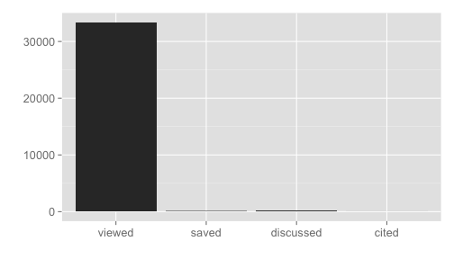
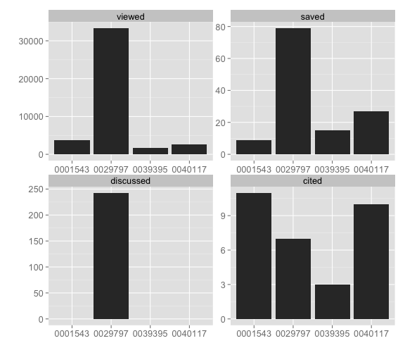
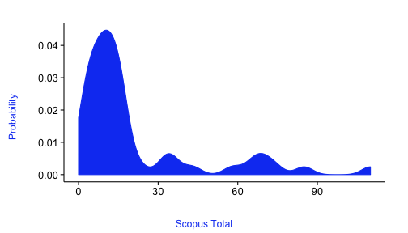
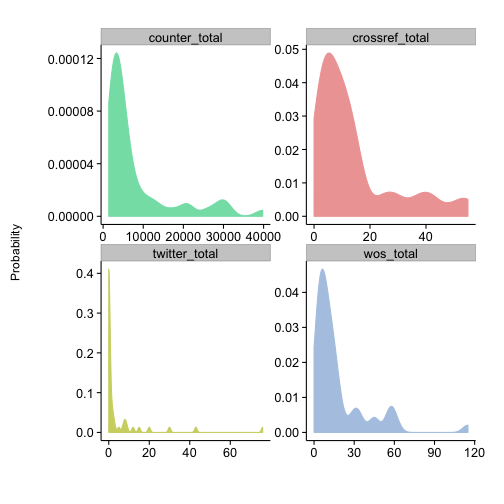

<pre>
       .__
_____  |  |   _____
\__  \ |  |  /     \
 / __ \|  |_|  Y Y  \
(____  /____/__|_|  /
     \/           \/
</pre>

|Platform|master|dev|
|----|----|----|
|Linux|[](https://travis-ci.org/ropensci/alm?branch=master)|[](https://travis-ci.org/ropensci/alm?branch=dev)|
|Windows|[](https://ci.appveyor.com/project/sckott/alm/branch/master)|[](https://ci.appveyor.com/project/sckott/alm/branch/dev)|

## What it is!?

The `alm` package is a set of functions to access article level metrics via a RESTful API from the Rails app `Lagotto` created by the Public Library of Science (PLOS). `Lagotto` is being used by PLOS, and a number of other publishers, including (as of 2014-10-14):

* PLOS (all their journals) at [http://alm.plos.org/]()
* PLOS test server at [http://labs.crowdometer.org/]()
* Copernicus at [http://metricus.copernicus.org/]()
* Public Knowledge Project (PKP) at [http://pkp-alm.lib.sfu.ca/]()
* Crossref at [http://det.labs.crossref.org/]()
* eLife at [http://alm.svr.elifesciences.org/]()
* Pensoft at [http://alm.pensoft.net:81/]()

## What is an article level metric?

Glad you asked. The canonical URL for this is perhaps [altmetrics.org](http://altmetrics.org/manifesto/). Basically it is a metric that measures something about an article. This is in stark contrast to journal level metrics, like the [Journal Impact Factor](http://www.wikiwand.com/en/Impact_factor).

## Are there other altmetrics data providers?

Yes indeedy.

+ [ImpactStory](http://impactstory.org/)
+ [Altmetric.com](http://altmetric.com/)
+ [PlumAnalytics](http://www.plumanalytics.com/)

## Authentication

You will need a different API key for each of the publishers listed above.

For each API key, go to the links above for each respective publisher.

Put each API key in your .Rprofile file using, for example, `options(PlosApiKey = "YOUalmAPIKEY")`, and the functions within this package will be able to use your API key without you having to enter it every time you run a search. Alternatively, you can set the key in your options just for the current session by executing `options(PlosApiKey = "YOUalmAPIKEY")`, or pass in to each function call with the `key` parameter.

`alm` defaults to using the entry in your options variables `PlosApiKey`, so to use a different publisher's data, pass in the key __AND__ the url for the service.

## Quick start

### Install

You can get this package from CRAN by:


```r
install.packages("alm")
```


Or the development version by installing with `install_github()`


```r
install.packages("devtools")
library('devtools')
install_github("ropensci/alm")
```

Load the package


```r
library('alm')
```

The first function we'll look at is `alm_ids()`, named with `ids` since we search for data by one of four different choices of identifier.

### Get altmetrics data for a single paper


```r
alm_ids(doi = "10.1371/journal.pone.0029797")
```

```
## $meta
##   total total_pages page error
## 1     1           1    1    NA
## 
## $data
##                       .id  pdf  html readers comments likes  total
## 1               citeulike   NA    NA       1       NA    NA      1
## 2                crossref   NA    NA      NA       NA    NA      8
## 3                  nature   NA    NA      NA       NA    NA      4
## 4                  pubmed   NA    NA      NA       NA    NA      2
## 5                  scopus   NA    NA      NA       NA    NA      7
## 6                 counter 2512 30600      NA       NA    NA  33228
## 7        researchblogging   NA    NA      NA       NA    NA      1
## 8                     wos   NA    NA      NA       NA    NA      7
## 9                     pmc   74   511      NA       NA    NA    585
## 10               facebook   NA    NA     149       22    60    231
## 11               mendeley   NA    NA      80       NA    NA     80
## 12                twitter   NA    NA      NA       12    NA     12
## 13              wikipedia   NA    NA      NA       NA    NA     49
## 14          scienceseeker   NA    NA      NA       NA    NA      0
## 15         relativemetric   NA    NA      NA       NA    NA 157436
## 16                  f1000   NA    NA      NA       NA    NA      0
## 17               figshare    0    18      NA       NA     0     18
## 18              pmceurope   NA    NA      NA       NA    NA      4
## 19          pmceuropedata   NA    NA      NA       NA    NA     49
## 20            openedition   NA    NA      NA       NA    NA      0
## 21              wordpress   NA    NA      NA       NA    NA      0
## 22                 reddit   NA    NA      NA        0     0      0
## 23               datacite   NA    NA      NA       NA    NA      0
## 24             copernicus   NA    NA      NA       NA    NA      0
## 25        articlecoverage   NA    NA      NA        0    NA      0
## 26 articlecoveragecurated   NA    NA      NA        0    NA      0
## 27          plos_comments   NA    NA      NA       11    NA     16
```

### Details for a single DOI


```r
alm_ids(doi = "10.1371/journal.pone.0029797", info = "detail")
```

```
## $meta
##   total total_pages page error
## 1     1           1    1    NA
## 
## $data
## $data$info
##                            doi
## 1 10.1371/journal.pone.0029797
##                                                                             title
## 1 Ecological Guild Evolution and the Discovery of the World's Smallest Vertebrate
##                                                                canonical_url
## 1 http://www.plosone.org/article/info%3Adoi%2F10.1371%2Fjournal.pone.0029797
##       pmid   pmcid                        mendeley_uuid
## 1 22253785 3256195 897fbbd6-5a23-3552-8077-97251b82c1e1
##            update_date     issued
## 1 2014-10-14T16:15:46Z 2012-01-11
## 
## $data$signposts
##                            doi viewed saved discussed cited
## 1 10.1371/journal.pone.0029797  33813    81       243     7
## 
## $data$totals
##                       .id  pdf  html readers comments likes  total
## 1               citeulike   NA    NA       1       NA    NA      1
## 2                crossref   NA    NA      NA       NA    NA      8
## 3                  nature   NA    NA      NA       NA    NA      4
## 4                  pubmed   NA    NA      NA       NA    NA      2
## 5                  scopus   NA    NA      NA       NA    NA      7
## 6                 counter 2512 30600      NA       NA    NA  33228
## 7        researchblogging   NA    NA      NA       NA    NA      1
## 8                     wos   NA    NA      NA       NA    NA      7
## 9                     pmc   74   511      NA       NA    NA    585
## 10               facebook   NA    NA     149       22    60    231
## 11               mendeley   NA    NA      80       NA    NA     80
## 12                twitter   NA    NA      NA       12    NA     12
## 13              wikipedia   NA    NA      NA       NA    NA     49
## 14          scienceseeker   NA    NA      NA       NA    NA      0
## 15         relativemetric   NA    NA      NA       NA    NA 157436
## 16                  f1000   NA    NA      NA       NA    NA      0
## 17               figshare    0    18      NA       NA     0     18
## 18              pmceurope   NA    NA      NA       NA    NA      4
## 19          pmceuropedata   NA    NA      NA       NA    NA     49
## 20            openedition   NA    NA      NA       NA    NA      0
## 21              wordpress   NA    NA      NA       NA    NA      0
## 22                 reddit   NA    NA      NA        0     0      0
## 23               datacite   NA    NA      NA       NA    NA      0
## 24             copernicus   NA    NA      NA       NA    NA      0
## 25        articlecoverage   NA    NA      NA        0    NA      0
## 26 articlecoveragecurated   NA    NA      NA        0    NA      0
## 27          plos_comments   NA    NA      NA       11    NA     16
## 
## $data$sum_metrics
##                .id year month day total X[[1L]]
## 1        citeulike 2012     1  12     1      NA
## 2           nature 2012     1  11     1      NA
## 3           nature 2012     1  12     1      NA
## 4           nature 2012     2   1     1      NA
## 5 researchblogging   NA    NA  NA    NA      NA
## 6    plos_comments 2012     1  11     1      NA
## 7    plos_comments 2012     1  12     7      NA
## 8    plos_comments 2012     1  13     1      NA
## 9    plos_comments 2012     1  14     1      NA
```

### Search on many identifiers


```r
dois <- c("10.1371/journal.pone.0001543", "10.1371/journal.pone.0040117", "10.1371/journal.pone.0029797", "10.1371/journal.pone.0039395")
out <- alm_ids(doi = dois)
lapply(out$data, head)
```

```
## $`10.1371/journal.pone.0040117`
##         .id pdf html readers comments likes total
## 1 citeulike  NA   NA       0       NA    NA     0
## 2  crossref  NA   NA      NA       NA    NA     6
## 3    nature  NA   NA      NA       NA    NA     0
## 4    pubmed  NA   NA      NA       NA    NA     5
## 5    scopus  NA   NA      NA       NA    NA    12
## 6   counter 393 1976      NA       NA    NA  2389
## 
## $`10.1371/journal.pone.0039395`
##         .id pdf html readers comments likes total
## 1 citeulike  NA   NA       0       NA    NA     0
## 2  crossref  NA   NA      NA       NA    NA     1
## 3    nature  NA   NA      NA       NA    NA     0
## 4    pubmed  NA   NA      NA       NA    NA     1
## 5    scopus  NA   NA      NA       NA    NA     3
## 6   counter 233 1336      NA       NA    NA  1596
## 
## $`10.1371/journal.pone.0029797`
##         .id  pdf  html readers comments likes total
## 1 citeulike   NA    NA       1       NA    NA     1
## 2  crossref   NA    NA      NA       NA    NA     8
## 3    nature   NA    NA      NA       NA    NA     4
## 4    pubmed   NA    NA      NA       NA    NA     2
## 5    scopus   NA    NA      NA       NA    NA     7
## 6   counter 2512 30600      NA       NA    NA 33228
## 
## $`10.1371/journal.pone.0001543`
##         .id pdf html readers comments likes total
## 1 citeulike  NA   NA       0       NA    NA     0
## 2  crossref  NA   NA      NA       NA    NA     7
## 3    nature  NA   NA      NA       NA    NA     0
## 4    pubmed  NA   NA      NA       NA    NA     7
## 5    scopus  NA   NA      NA       NA    NA    11
## 6   counter 452 2727      NA       NA    NA  3226
```

### Output an-easy-to-combine-with-other-results data.frame


```r
res <- alm_ids(doi = "10.1371/journal.pone.0035869", total_details = TRUE)
res$data[, 3:10]
```

```
##   citeulike_pdf citeulike_html citeulike_readers citeulike_comments
## 1            NA             NA                27                 NA
##   citeulike_likes citeulike_total crossref_pdf crossref_html
## 1              NA              27           NA            NA
```

### Get detailed data for altmetrics using `almevents`


```r
out <- alm_events(doi = "10.1371/journal.pone.0029797")
names(out)  # names of sources
```

```
##  [1] "citeulike"        "crossref"         "nature"          
##  [4] "pubmed"           "scopus"           "counter"         
##  [7] "researchblogging" "pmc"              "facebook"        
## [10] "mendeley"         "twitter"          "wikipedia"       
## [13] "relativemetric"   "figshare"         "pmceuropedata"   
## [16] "plos_comments"
```


```r
out <- out[!out %in% c("sorry, no events content yet", "parser not written yet")]  # remove those with no data
out[["pmc"]]  # get the results for PubMed Central
```

```
## $events_url
## [1] "http://www.ncbi.nlm.nih.gov/pmc/articles/PMC3256195"
## 
## $events
##    scanned.page.browse month cited.by abstract full.text unique.ip pdf
## 1                    0     1        0        1        51        42   8
## 2                    0     2        0        0        15        11   4
## 3                    0     3        0        0        11        12   4
## 4                    0     4        0        1         6         6   2
## 5                    0     5        0        0         5         5   1
## 6                    0     6        0        0         7         9   2
## 7                    0     7        0        1         6         8   3
## 8                    0     8        0        1         5         4   0
## 9                    0     9        0        0        14        13   5
## 10                   0    10        0        1        20        16   4
## 11                   0    12        0        0        13        12   1
## 12                   0     1        0        0        13        14   7
## 13                   0     3        0        1        22        20   2
## 14                   0     2        0        0        13        10   2
## 15                   0     4        1        1        45        24   4
## 16                   0    11        0        1        10         9   1
## 17                   0     5        0        0        18        21   5
## 18                   0     6        0        0        12        11   1
## 19                   0     7        0        0        27        14   1
## 20                   0     8        0        0        21        13   0
## 21                   0     9        0        0        14        13   0
## 22                   0    10        0        0        14        15   3
## 23                   0    11        0        6        18        16   2
## 24                   0    12        0        0        14         9   1
## 25                   0     1        0        0        22        16   1
## 26                   0     2        0        0        13        12   1
## 27                   0     3        0        0        11        10   1
## 28                   0     5        0        0        15        12   0
## 29                   0     6        0        0        12        12   2
## 30                   0     4        0        0         8         9   1
## 31                   0     8        0        0        18        14   3
## 32                   0     9        0        0        18        20   2
##    year figure scanned.summary supp.data
## 1  2012      9               0         0
## 2  2012     11               0         2
## 3  2012      0               0         0
## 4  2012      0               0         0
## 5  2012      0               0         0
## 6  2012      2               0         0
## 7  2012      3               0         0
## 8  2012      0               0         0
## 9  2012      3               0         0
## 10 2012      1               0         0
## 11 2012      1               0         0
## 12 2013      0               0         0
## 13 2013      0               0         0
## 14 2013      0               0         0
## 15 2013      3               0         1
## 16 2012      0               0         0
## 17 2013      0               0         1
## 18 2013      0               0         1
## 19 2013      0               0         0
## 20 2013      0               0         0
## 21 2013      0               0         1
## 22 2013      2               0         0
## 23 2013      0               0         0
## 24 2013      0               0         0
## 25 2014      0               0         0
## 26 2014      0               0         0
## 27 2014      2               0         0
## 28 2014      0               0         1
## 29 2014      0               0         0
## 30 2014      0               0         1
## 31 2014      0               0         0
## 32 2014      0               0         0
## 
## $csl
## list()
```

### Retrieve and plot PLOS article-level metrics signposts.


```r
dat <- alm_signposts(doi = "10.1371/journal.pone.0029797")
plot_signposts(dat)
```

 

Or plot many identifiers get a faceted bar chart, note the tick labels have just the last part of the DOI in this case to help you identify each DOI - printing the entire DOI would make lables overlap one another.


```r
dois <- c("10.1371/journal.pone.0001543", "10.1371/journal.pone.0040117", "10.1371/journal.pone.0029797", "10.1371/journal.pone.0039395")
dat <- alm_signposts(doi = dois)
plot_signposts(input = dat)
```

 

Or make an interactive chart by doing `plot_signposts(input=dat, type="multiBarChart")`. Try it out! It should open in your browser and you can interact with it.

#### Density and histogram plots from PLOS Article Level Metrics data

Note: Do you the key below in the `searchplos` call in this example, but if you plan to use rplos more, get your own API key [here](http://api.plos.org/).


```r
library('rplos')
library('plyr')
dois <- searchplos(q = "science", fl = "id", fq = list("-article_type:correction", "cross_published_journal_key:PLoSONE", "doc_type:full", "publication_date:[2010-01-01T00:00:00Z TO 2010-12-31T23:59:59Z]"), limit = 50)
dois <- dois$data$id
```


Collect altmetrics data and combine to a `data.frame` with `ldply`


```r
alm <- alm_ids(doi = dois, total_details = TRUE)
alm <- ldply(alm$data)
```


The default plot


```r
plot_density(alm)
```

 


Plot many sources in different panels in the same plot, and pass in colors just for fun


```r
plot_density(input = alm, source = c("counter_total", "crossref_total",
    "twitter_total", "wos_total"), color = c("#83DFB4", "#EFA5A5", "#CFD470",
    "#B2C9E4"))
```

 

### Work with data from non-PLOS publishers

Crossref


```r
crurl <- "http://alm.labs.crossref.org/api/v5/articles"
crkey <- getOption("crossrefalmkey")
alm_ids(doi='10.1371/journal.pone.0086859', url = crurl, key = crkey)
```

```
## $meta
##      total total_pages page error
## 1 11636001      232721    1    NA
## 
## $data
##              .id pdf html readers comments likes total
## 1       crossref  NA   NA      NA       NA    NA     0
## 2       mendeley  NA   NA      NA       NA    NA     0
## 3       facebook  NA   NA      NA       NA    NA     0
## 4            pmc  NA   NA      NA       NA    NA     0
## 5      citeulike  NA   NA      NA       NA    NA     0
## 6         pubmed  NA   NA      NA       NA    NA     0
## 7      wordpress  NA   NA      NA       NA    NA     0
## 8         reddit  NA   NA      NA       NA    NA     0
## 9      wikipedia  NA   NA      NA       NA    NA     2
## 10      datacite  NA   NA      NA       NA    NA     0
## 11     pmceurope  NA   NA      NA       NA    NA     0
## 12 pmceuropedata  NA   NA      NA       NA    NA     0
```

eLife


```r
elifeurl <- "http://alm.svr.elifesciences.org/api/v5/articles"
elifekey <- getOption("elifealmkey")
alm_ids(doi='10.7554/eLife.00471', url = elifeurl, key = elifekey)
```

```
## $meta
##   total total_pages page error
## 1     1           1    1    NA
## 
## $data
##               .id pdf html shares groups comments likes citations total
## 1             pmc 242  639     NA     NA       NA    NA        NA   881
## 2        crossref  NA   NA     NA     NA       NA    NA       135   135
## 3          scopus  NA   NA     NA     NA       NA    NA       133   133
## 4        facebook  NA   NA      3     NA        0     0        NA     3
## 5        mendeley  NA   NA    454      0       NA    NA        NA   454
## 6  twitter_search  NA   NA     NA     NA        0    NA        NA     0
## 7       citeulike  NA   NA      1     NA       NA    NA        NA     1
## 8          pubmed  NA   NA     NA     NA       NA    NA        72    72
## 9       wordpress  NA   NA     NA     NA       NA    NA         5     5
## 10         reddit  NA   NA     NA     NA        0     0        NA     0
## 11      wikipedia  NA   NA     NA     NA       NA    NA         0     0
## 12       datacite  NA   NA     NA     NA       NA    NA         0     0
## 13      pmceurope  NA   NA     NA     NA       NA    NA       131   131
## 14  pmceuropedata  NA   NA     NA     NA       NA    NA         1     1
## 15  scienceseeker  NA   NA     NA     NA       NA    NA         0     0
## 16         nature  NA   NA     NA     NA       NA    NA         0     0
## 17    openedition  NA   NA     NA     NA       NA    NA         0     0
## 18          f1000  NA   NA     NA     NA       NA    NA         4     4
## 19       figshare  NA   NA     NA     NA       NA    NA         0     0
## 20  plos_comments  NA   NA     NA     NA       NA    NA         0     0
## 21       connotea  NA   NA     NA     NA       NA    NA         0     0
## 22    postgenomic  NA   NA     NA     NA       NA    NA         0     0
## 23      bloglines  NA   NA     NA     NA       NA    NA         0     0
## 24           biod  NA   NA     NA     NA       NA    NA        NA     0
```

Pensoft


```r
psurl <- 'http://alm.pensoft.net:81/api/v5/articles'
pskey <- getOption("pensoftalmkey")
alm_ids(doi='10.3897/zookeys.88.807', url = psurl, key = pskey)
```

```
## $meta
##   total total_pages page error
## 1     1           1    1    NA
## 
## $data
##               .id pdf html readers comments likes total
## 1        facebook  NA   NA      NA       NA    NA     0
## 2      copernicus   0    0      NA       NA    NA     0
## 3       wikipedia  NA   NA      NA       NA    NA   136
## 4          nature  NA   NA      NA       NA    NA     0
## 5       citeulike  NA   NA       1       NA    NA     1
## 6        crossref  NA   NA      NA       NA    NA    81
## 7        datacite  NA   NA      NA       NA    NA     0
## 8   pmceuropedata  NA   NA      NA       NA    NA     0
## 9          pubmed  NA   NA      NA       NA    NA    51
## 10          f1000  NA   NA      NA       NA    NA     0
## 11         scopus  NA   NA      NA       NA    NA   176
## 12       figshare  NA   NA      NA       NA    NA     0
## 13        counter  NA   NA      NA       NA    NA     0
## 14       mendeley  NA   NA     123       NA    NA   123
## 15         reddit  NA   NA      NA        0     0     0
## 16 twitter_search  NA   NA      NA        0    NA     0
## 17      wordpress  NA   NA      NA       NA    NA     0
## 18      pmceurope  NA   NA      NA       NA    NA    52
```

## Meta

* Please [report any issues or bugs](https://github.com/ropensci/alm/issues).
* License: MIT
* Get citation information for `alm` in R doing `citation(package = 'alm')`

[](http://ropensci.org)
