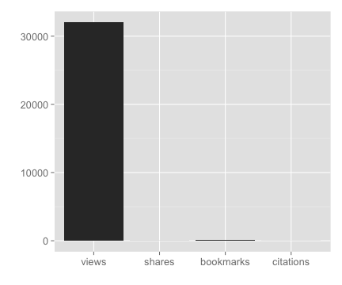
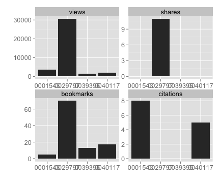
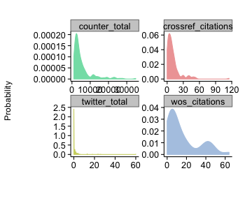

<pre>
         __      | 			|\      /|
        /  \     | 			| \    / |
       / -- \    | 			|  \  /  |
      /      \   | 			|   \/   |
     /        \  |_______ 	|        |
</pre>

[](https://travis-ci.org/ropensci/alm)

### What it is!?

`alm` is a set of functions to access article level metrics from the Public Library of Science journals using their ALM API.


### What is an article level metric?

Glad you asked. The canonical URL for this is perhaps [altmetrics.org](http://altmetrics.org/manifesto/). Basically it is a metric that measures something about an article. This is in stark contrast to journal level metrics, like the Journal Impact Factor.

### Are there other altmetrics data providers?

Yes indeedy.

+ [ImpactStory](http://impactstory.it/)
+ [Altmetric.com](http://altmetric.com/)
+ [PlumAnalytics](http://www.plumanalytics.com/)

### Authentication

You aren't currently not required to use an API key to access the PLoS ALM API, but soon will need to.

Get your PLoS API key [here](http://api.plos.org/)

Put your API key in your .Rprofile file using exactly this:
options(PlosApiKey = "YOUalmAPIKEY"),
and the functions within this package will be able to use your API key without you having to enter it every time you run a search.

### Quick start

#### Install

You can get this package by installing via `install_github()` within Hadley Wickham's devtools package.

```coffee
install.packages("devtools")
require(devtools)
install_github("alm", "rOpenSci")
require(alm)
```

#### Get altmetrics data for a single paper

```coffee
alm(doi = "10.1371/journal.pone.0029797")[, -c(6:8)]
```

```
                      .id  pdf  html shares groups  total
1               citeulike   NA    NA      1     NA      1
2                crossref   NA    NA     NA     NA      7
3                  nature   NA    NA     NA     NA      4
4                  pubmed   NA    NA     NA     NA      2
5                  scopus   NA    NA     NA     NA      0
6                 counter 2371 27772     NA     NA  30251
7        researchblogging   NA    NA     NA     NA      1
8                     wos   NA    NA     NA     NA      6
9                     pmc   64   416     NA     NA    480
10               facebook   NA    NA      0     NA      0
11               mendeley   NA    NA     69      0     69
12                twitter   NA    NA     NA     NA     11
13              wikipedia   NA    NA     NA     NA     49
14          scienceseeker   NA    NA     NA     NA      0
15         relativemetric   NA    NA     NA     NA 150729
16                  f1000   NA    NA     NA     NA      0
17               figshare    0     8     NA     NA      8
18              pmceurope   NA    NA     NA     NA      4
19          pmceuropedata   NA    NA     NA     NA     10
20            openedition   NA    NA     NA     NA      0
21              wordpress   NA    NA     NA     NA      0
22                 reddit   NA    NA     NA     NA      0
23               datacite   NA    NA     NA     NA      0
24             copernicus   NA    NA     NA     NA      0
25        articlecoverage   NA    NA     NA     NA      0
26 articlecoveragecurated   NA    NA     NA     NA      0
27          plos_comments   NA    NA     NA     NA     16
```


#### Details for a single DOI


```coffee
out <- alm(doi = "10.1371/journal.pone.0029797", info = "detail")
## totals
out[["totals"]][, -c(6:8)]
```

```
                      .id  pdf  html shares groups  total
1               citeulike   NA    NA      1     NA      1
2                crossref   NA    NA     NA     NA      7
3                  nature   NA    NA     NA     NA      4
4                  pubmed   NA    NA     NA     NA      2
5                  scopus   NA    NA     NA     NA      0
6                 counter 2371 27772     NA     NA  30251
7        researchblogging   NA    NA     NA     NA      1
8                     pmc   64   416     NA     NA    480
9                facebook   NA    NA      0     NA      0
10               mendeley   NA    NA     69      0     69
11                twitter   NA    NA     NA     NA     11
12              wikipedia   NA    NA     NA     NA     49
13          scienceseeker   NA    NA     NA     NA      0
14         relativemetric   NA    NA     NA     NA 150729
15                  f1000   NA    NA     NA     NA      0
16               figshare    0     8     NA     NA      8
17              pmceurope   NA    NA     NA     NA      4
18          pmceuropedata   NA    NA     NA     NA     10
19            openedition   NA    NA     NA     NA      0
20              wordpress   NA    NA     NA     NA      0
21                 reddit   NA    NA     NA     NA      0
22               datacite   NA    NA     NA     NA      0
23             copernicus   NA    NA     NA     NA      0
24        articlecoverage   NA    NA     NA     NA      0
25 articlecoveragecurated   NA    NA     NA     NA      0
26          plos_comments   NA    NA     NA     NA     16
```

```coffee
## history
head(out[["history"]])
```

```
        .id      dates totals
1 citeulike 2014-01-27      1
2  crossref 2014-01-26      7
3    nature 2014-01-30      4
4    pubmed 2014-01-25      2
5   counter 2014-02-25  30251
6   counter 2014-02-24  30238
```


#### Search on many identifiers


```coffee
dois <- c("10.1371/journal.pone.0001543", "10.1371/journal.pone.0040117", "10.1371/journal.pone.0029797",
    "10.1371/journal.pone.0039395")
out <- alm(doi = dois)
lapply(out, head)
```

```
[[1]]
        .id pdf html shares groups comments likes citations total
1 citeulike  NA   NA      0     NA       NA    NA        NA     0
2  crossref  NA   NA     NA     NA       NA    NA         3     3
3    nature  NA   NA     NA     NA       NA    NA         0     0
4    pubmed  NA   NA     NA     NA       NA    NA         1     1
5    scopus  NA   NA     NA     NA       NA    NA         5     5
6   counter 298 1408     NA     NA       NA    NA        NA  1719

[[2]]
        .id pdf html shares groups comments likes citations total
1 citeulike  NA   NA      0     NA       NA    NA        NA     0
2  crossref  NA   NA     NA     NA       NA    NA         0     0
3    nature  NA   NA     NA     NA       NA    NA         0     0
4    pubmed  NA   NA     NA     NA       NA    NA         1     1
5    scopus  NA   NA     NA     NA       NA    NA         0     0
6   counter 201  994     NA     NA       NA    NA        NA  1217

[[3]]
        .id  pdf  html shares groups comments likes citations total
1 citeulike   NA    NA      1     NA       NA    NA        NA     1
2  crossref   NA    NA     NA     NA       NA    NA         7     7
3    nature   NA    NA     NA     NA       NA    NA         4     4
4    pubmed   NA    NA     NA     NA       NA    NA         2     2
5    scopus   NA    NA     NA     NA       NA    NA         0     0
6   counter 2371 27772     NA     NA       NA    NA        NA 30251

[[4]]
        .id pdf html shares groups comments likes citations total
1 citeulike  NA   NA      0     NA       NA    NA        NA     0
2  crossref  NA   NA     NA     NA       NA    NA         7     7
3    nature  NA   NA     NA     NA       NA    NA         0     0
4    pubmed  NA   NA     NA     NA       NA    NA         6     6
5    scopus  NA   NA     NA     NA       NA    NA         8     8
6   counter 426 2580     NA     NA       NA    NA        NA  3046
```

#### Output an-easy-to-combine-with-other-results data.frame


```coffee
alm(doi = "10.1371/journal.pone.0035869", total_details = TRUE)[, 3:10]
```

```
      publication_date citeulike_pdf citeulike_html citeulike_shares
1 2012-05-11T07:00:00Z            NA             NA               25
  citeulike_groups citeulike_comments citeulike_likes citeulike_citations
1               NA                 NA              NA                  NA
```

#### Get detailed data for altmetrics using `almevents`


```coffee
out <- almevents(doi = "10.1371/journal.pone.0029797")
names(out)  # names of sources
```

```
 [1] "citeulike"              "crossref"
 [3] "nature"                 "pubmed"
 [5] "scopus"                 "counter"
 [7] "researchblogging"       "pmc"
 [9] "facebook"               "mendeley"
[11] "twitter"                "wikipedia"
[13] "scienceseeker"          "relativemetric"
[15] "f1000"                  "figshare"
[17] "pmceurope"              "pmceuropedata"
[19] "openedition"            "wordpress"
[21] "reddit"                 "datacite"
[23] "copernicus"             "articlecoverage"
[25] "articlecoveragecurated" "plos_comments"
```

```coffee
out <- out[!out %in% c("sorry, no events content yet", "parser not written yet")]  # remove those with no data
out[["pmc"]]  # get the results for PubMed Central
```

```
   abstract cited-by figure full-text month pdf scanned-page-browse
1         1        0      9        51     1   8                   0
2         0        0     11        15     2   4                   0
3         0        0      0        11     3   4                   0
4         1        0      0         6     4   2                   0
5         0        0      0         5     5   1                   0
6         0        0      2         7     6   2                   0
7         1        0      3         6     7   3                   0
8         1        0      0         5     8   0                   0
9         0        0      3        14     9   5                   0
10        1        0      1        20    10   4                   0
11        0        0      1        13    12   1                   0
12        0        0      0        13     1   7                   0
13        1        0      0        22     3   2                   0
14        0        0      0        13     2   2                   0
15        1        1      3        45     4   4                   0
16        1        0      0        10    11   1                   0
17        0        0      0        18     5   5                   0
18        0        0      0        12     6   1                   0
19        0        0      0        27     7   1                   0
20        0        0      0        21     8   0                   0
21        0        0      0        14     9   0                   0
22        0        0      2        14    10   3                   0
23        6        0      0        18    11   2                   0
24        0        0      0        14    12   1                   0
25        0        0      0        22     1   1                   0
   scanned-summary supp-data unique-ip year
1                0         0        42 2012
2                0         2        11 2012
3                0         0        12 2012
4                0         0         6 2012
5                0         0         5 2012
6                0         0         9 2012
7                0         0         8 2012
8                0         0         4 2012
9                0         0        13 2012
10               0         0        16 2012
11               0         0        12 2012
12               0         0        14 2013
13               0         0        20 2013
14               0         0        10 2013
15               0         1        24 2013
16               0         0         9 2012
17               0         1        21 2013
18               0         1        11 2013
19               0         0        14 2013
20               0         0        13 2013
21               0         1        13 2013
22               0         0        15 2013
23               0         0        16 2013
24               0         0         9 2013
25               0         0        16 2014
```

#### Retrieve and plot PLOS article-level metrics signposts.


```coffee
dat <- signposts(doi = "10.1371/journal.pone.0029797")
plot_signposts(input = dat)
```




Or plot many identifiers gives a line chart


```coffee
dois <- c("10.1371/journal.pone.0001543", "10.1371/journal.pone.0040117", "10.1371/journal.pone.0029797",
    "10.1371/journal.pone.0039395")
dat <- signposts(doi = dois)
plot_signposts(input = dat)
```




Or make an interactive chart by doing `plot_signposts(input=dat, type="multiBarChart")`. Try it out! It should open in your browser and you can interact with it.

#### Density and histogram plots from PLOS Article Level Metrics data

Note: Do you the key below in the `searchplos` call in this example, but if you plan to use rplos more, get your own API key [here](http://api.plos.org/).


```coffee
library(rplos)
library(plyr)
dois <- searchplos(terms = "science", fields = "id", toquery = list("cross_published_journal_key:PLoSONE",
    "doc_type:full", "publication_date:[2010-01-01T00:00:00Z TO 2010-12-31T23:59:59Z]"),
    limit = 200)
```


Remove non-full article DOIs


```coffee
dois <- dois$id
dois <- dois[!grepl("annotation", dois)]
```


Collect altmetrics data and combine to a `data.frame` with `ldply`


```coffee
alm <- alm(doi = dois, total_details = TRUE)
alm <- ldply(alm)
```


The default plot


```coffee
plot_density(alm)
```


Plot many sources in different panels in the same plot, and pass in colors just for fun


```coffee
plot_density(input = alm, source = c("counter_total", "crossref_citations",
    "twitter_total", "wos_citations"), color = c("#83DFB4", "#EFA5A5", "#CFD470",
    "#B2C9E4"))
```




[](http://ropensci.org)
