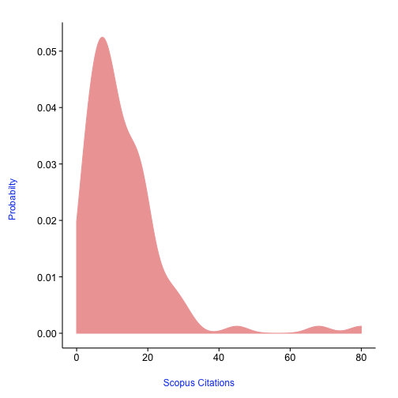
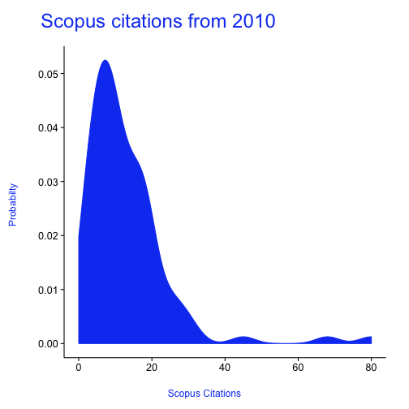

<!--
%\VignetteEngine{knitr}
%\VignetteIndexEntry{An R Markdown Vignette made with knitr}
-->

alm tutorial
======

## What are article level metrics? 

Glad you asked. The canonical URL for this is perhaps [altmetrics.org](http://altmetrics.org/manifesto/). Basically it is a metric that measures something about an article. This is in stark contrast to journal level metrics, like the Journal Impact Factor. 

## Are there other altmetrics data providers?

Yes indeedy. 

+ [ImpactStory](http://impactstory.it/)
+ [Altmetric.com](http://altmetric.com/)
+ [PlumAnalytics](http://www.plumanalytics.com/)

## Authentication

You aren't currently not required to use an API key to access the PLoS ALM API, but soon will need to.

Get your PLoS API key [here](http://api.plos.org/)

Put your API key in your .Rprofile file using exactly this: 
options(PlosApiKey = "YOUalmAPIKEY"), 
and the functions within this package will be able to use your API key without you having to enter it every time you run a search. 

## Install and load

You can get this package by installing via `install_github()` within Hadley Wickham's devtools package.


```r
install.packages("devtools")
require(devtools)
install_github("alm", "rOpenSci")
```


```r
library(alm)
```


## The default call with either doi, pmid, pmcid, or mdid without specifying an argument for info

(We'll not print a few columns so the table prints nicely)


```r
alm(doi = "10.1371/journal.pone.0029797")[, -c(6:8)]
```

```
                .id  pdf  html shares groups total
1         bloglines   NA    NA     NA     NA     0
2         citeulike   NA    NA      1     NA     1
3          connotea   NA    NA     NA     NA     0
4          crossref   NA    NA     NA     NA     7
5            nature   NA    NA     NA     NA     4
6       postgenomic   NA    NA     NA     NA     0
7            pubmed   NA    NA     NA     NA     1
8            scopus   NA    NA     NA     NA     4
9           counter 2274 26410     NA     NA 28790
10 researchblogging   NA    NA     NA     NA     1
11             biod    0     0     NA     NA    21
12              pmc   57   334     NA     NA   391
13         facebook   NA    NA    147     NA   228
14         mendeley   NA    NA     50      0    50
15          twitter   NA    NA     NA     NA     9
16        wikipedia   NA    NA     NA     NA    49
17    scienceseeker   NA    NA     NA     NA     0
18   relativemetric   NA    NA     NA     NA 46986
19            f1000   NA    NA     NA     NA     0
20         figshare   NA    NA     NA     NA     0
```


## Details for a single DOI


```r
out <- alm(doi = "10.1371/journal.pone.0029797", info = "detail")
## totals
out[["totals"]][, -c(6:8)]
```

```
                .id  pdf  html shares groups total
1         bloglines   NA    NA     NA     NA     0
2         citeulike   NA    NA      1     NA     1
3          connotea   NA    NA     NA     NA     0
4          crossref   NA    NA     NA     NA     7
5            nature   NA    NA     NA     NA     4
6       postgenomic   NA    NA     NA     NA     0
7            pubmed   NA    NA     NA     NA     1
8            scopus   NA    NA     NA     NA     4
9           counter 2274 26410     NA     NA 28790
10 researchblogging   NA    NA     NA     NA     1
11             biod    0     0     NA     NA    21
12              pmc   57   334     NA     NA   391
13         facebook   NA    NA    147     NA   228
14         mendeley   NA    NA     50      0    50
15          twitter   NA    NA     NA     NA     9
16        wikipedia   NA    NA     NA     NA    49
17    scienceseeker   NA    NA     NA     NA     0
18   relativemetric   NA    NA     NA     NA 46986
19            f1000   NA    NA     NA     NA     0
20         figshare   NA    NA     NA     NA     0
```

```r
## history
head(out[["history"]])
```

```
        .id      dates totals
1 citeulike 2013-09-16      1
2 citeulike 2013-08-15      1
3 citeulike 2013-07-13      1
4 citeulike 2013-06-10      1
5 citeulike 2013-05-08      1
6 citeulike 2013-04-05      1
```


## Search using various identifiers, including pubmed id, pmc id, and mendeley id


```r
# A single PubMed ID (pmid)
alm(pmid = 22590526)[, -c(6:8)]
```

```
                .id pdf  html shares groups total
1         bloglines  NA    NA     NA     NA     0
2         citeulike  NA    NA      5     NA     5
3          connotea  NA    NA     NA     NA     0
4          crossref  NA    NA     NA     NA     3
5            nature  NA    NA     NA     NA     1
6       postgenomic  NA    NA     NA     NA     0
7            pubmed  NA    NA     NA     NA     1
8            scopus  NA    NA     NA     NA     2
9           counter 909 13050     NA     NA 13995
10 researchblogging  NA    NA     NA     NA     1
11             biod  NA    NA     NA     NA     0
12              wos  NA    NA     NA     NA     2
13              pmc  23   113     NA     NA   136
14         facebook  NA    NA     59     NA   161
15         mendeley  NA    NA     39      0    39
16          twitter  NA    NA     NA     NA   118
17        wikipedia  NA    NA     NA     NA     0
18    scienceseeker  NA    NA     NA     NA     1
19   relativemetric  NA    NA     NA     NA 27039
20            f1000  NA    NA     NA     NA     0
21         figshare  NA    NA     NA     NA     0
```

```r

# A single PubMed Central ID (pmcid)
alm(pmcid = 212692)[, -c(6:8)]
```

```
                .id  pdf  html shares groups   total
1         bloglines   NA    NA     NA     NA       0
2         citeulike   NA    NA      8     NA       8
3          connotea   NA    NA     NA     NA       0
4          crossref   NA    NA     NA     NA     143
5            nature   NA    NA     NA     NA       0
6       postgenomic   NA    NA     NA     NA       0
7            pubmed   NA    NA     NA     NA     143
8            scopus   NA    NA     NA     NA     318
9           counter 2447 19698     NA     NA   22292
10 researchblogging   NA    NA     NA     NA       0
11             biod   NA    NA     NA     NA       0
12              pmc 2305  4752     NA     NA    7057
13         facebook   NA    NA      0     NA       0
14         mendeley   NA    NA     71      0      71
15          twitter   NA    NA     NA     NA       0
16        wikipedia   NA    NA     NA     NA       0
17    scienceseeker   NA    NA     NA     NA       0
18   relativemetric   NA    NA     NA     NA 2192654
19            f1000   NA    NA     NA     NA       0
20         figshare    1     2     NA     NA       3
```

```r

# A single Mendeley UUID (mdid)
alm(mdid = "35791700-6d00-11df-a2b2-0026b95e3eb7")[, -c(6:8)]
```

```
                .id  pdf  html shares groups   total
1         bloglines   NA    NA     NA     NA       0
2         citeulike   NA    NA      8     NA       8
3          connotea   NA    NA     NA     NA       0
4          crossref   NA    NA     NA     NA     143
5            nature   NA    NA     NA     NA       0
6       postgenomic   NA    NA     NA     NA       0
7            pubmed   NA    NA     NA     NA     143
8            scopus   NA    NA     NA     NA     318
9           counter 2447 19698     NA     NA   22292
10 researchblogging   NA    NA     NA     NA       0
11             biod   NA    NA     NA     NA       0
12              pmc 2305  4752     NA     NA    7057
13         facebook   NA    NA      0     NA       0
14         mendeley   NA    NA     71      0      71
15          twitter   NA    NA     NA     NA       0
16        wikipedia   NA    NA     NA     NA       0
17    scienceseeker   NA    NA     NA     NA       0
18   relativemetric   NA    NA     NA     NA 2192654
19            f1000   NA    NA     NA     NA       0
20         figshare    1     2     NA     NA       3
```


## Search on many identifiers


```r
dois <- c("10.1371/journal.pone.0001543", "10.1371/journal.pone.0040117", "10.1371/journal.pone.0029797", 
    "10.1371/journal.pone.0039395")
out <- alm(doi = dois)
lapply(out, head)
```

```
[[1]]
          .id pdf html shares groups comments likes citations total
1   bloglines  NA   NA     NA     NA       NA    NA         0     0
2   citeulike  NA   NA      0     NA       NA    NA        NA     0
3    connotea  NA   NA     NA     NA       NA    NA         0     0
4    crossref  NA   NA     NA     NA       NA    NA         1     1
5      nature  NA   NA     NA     NA       NA    NA         0     0
6 postgenomic  NA   NA     NA     NA       NA    NA         0     0

[[2]]
          .id pdf html shares groups comments likes citations total
1   bloglines  NA   NA     NA     NA       NA    NA         0     0
2   citeulike  NA   NA      0     NA       NA    NA        NA     0
3    connotea  NA   NA     NA     NA       NA    NA         0     0
4    crossref  NA   NA     NA     NA       NA    NA         0     0
5      nature  NA   NA     NA     NA       NA    NA         0     0
6 postgenomic  NA   NA     NA     NA       NA    NA         0     0

[[3]]
          .id pdf html shares groups comments likes citations total
1   bloglines  NA   NA     NA     NA       NA    NA         0     0
2   citeulike  NA   NA      1     NA       NA    NA        NA     1
3    connotea  NA   NA     NA     NA       NA    NA         0     0
4    crossref  NA   NA     NA     NA       NA    NA         7     7
5      nature  NA   NA     NA     NA       NA    NA         4     4
6 postgenomic  NA   NA     NA     NA       NA    NA         0     0

[[4]]
          .id pdf html shares groups comments likes citations total
1   bloglines  NA   NA     NA     NA       NA    NA         0     0
2   citeulike  NA   NA      0     NA       NA    NA        NA     0
3    connotea  NA   NA     NA     NA       NA    NA         0     0
4    crossref  NA   NA     NA     NA       NA    NA         5     5
5      nature  NA   NA     NA     NA       NA    NA         0     0
6 postgenomic  NA   NA     NA     NA       NA    NA         1     1
```


## Get altmetrics by year

You can also get metrics by day (`sum_metrics='day'`) or month (`sum_metrics='month'`)


```r
alm(doi = "10.1371/journal.pone.0036240", sum_metrics = "year")[, -c(6:8)]
```

```
                .id  x year pdf  html likes citations total
1         bloglines NA   NA  NA    NA    NA        NA    NA
2         citeulike NA 2012  NA    NA    NA        NA     5
3          connotea NA   NA  NA    NA    NA        NA    NA
4          crossref NA 2013  NA    NA    NA         3     3
5            nature NA   NA  NA    NA    NA        NA    NA
6       postgenomic NA   NA  NA    NA    NA        NA    NA
7            pubmed NA   NA  NA    NA    NA        NA    NA
8            scopus NA   NA  NA    NA    NA        NA    NA
9           counter NA 2012 699 10502    NA        NA 11234
10          counter NA 2013 210  2548    NA        NA  2761
11 researchblogging NA 2013  NA    NA    NA         1     1
12             biod NA   NA  NA    NA    NA        NA    NA
13              pmc NA 2012  16    53    NA        NA    69
14              pmc NA 2013   7    60    NA        NA    67
15         facebook NA   NA  NA    NA    NA        NA    NA
16         mendeley NA   NA  NA    NA    NA        NA    NA
17          twitter NA 2012  NA    NA    NA        NA   103
18          twitter NA 2013  NA    NA    NA        NA    15
19        wikipedia NA   NA  NA    NA    NA        NA    NA
20    scienceseeker NA 2013  NA    NA    NA         1     1
21   relativemetric NA   NA  NA    NA    NA        NA    NA
22            f1000 NA   NA  NA    NA    NA        NA    NA
23         figshare NA   NA  NA    NA    NA        NA    NA
```


## Output an-easy-to-combine-with-other-results data.frame


```r
alm(doi = "10.1371/journal.pone.0035869", total_details = TRUE)[, 3:10]
```

```
      publication_date bloglines_pdf bloglines_html bloglines_shares
1 2012-05-11T07:00:00Z            NA             NA               NA
  bloglines_groups bloglines_comments bloglines_likes bloglines_citations
1               NA                 NA              NA                   0
```


## Get altmetrics data for a single paper, and visualize the total data across dates


```r
out <- alm(doi = "10.1371/journal.pone.0001543", info = "detail")
almplot(out, type = "totalmetrics")
```

 


## Get detailed data for altmetrics using `almevents`


```r
out <- almevents(doi = "10.1371/journal.pone.0029797")
names(out)  # names of sources
```

```
 [1] "bloglines"        "citeulike"        "connotea"        
 [4] "crossref"         "nature"           "postgenomic"     
 [7] "pubmed"           "scopus"           "counter"         
[10] "researchblogging" "biod"             "pmc"             
[13] "facebook"         "mendeley"         "twitter"         
[16] "wikipedia"        "scienceseeker"    "relativemetric"  
[19] "f1000"            "figshare"        
```

```r
out <- out[!out %in% c("sorry, no events content yet", "parser not written yet")]  # remove those with no data
out[["pmc"]]  # get the results for PubMed Central
```

```
   abstract cited-by figure full-text month pdf scanned-page-browse
1         1        0      9        51     1   8                   0
2         0        0     11        15     2   4                   0
3         0        0      0        11     3   4                   0
4         1        0      0         6     4   2                   0
5         0        0      0         5     5   1                   0
6         0        0      2         7     6   2                   0
7         1        0      3         6     7   3                   0
8         1        0      0         5     8   0                   0
9         0        0      3        14     9   5                   0
10        1        0      1        20    10   4                   0
11        0        0      1        13    12   1                   0
12        1        0      0        10    11   1                   0
   scanned-summary supp-data unique-ip year
1                0         0        42 2012
2                0         2        11 2012
3                0         0        12 2012
4                0         0         6 2012
5                0         0         5 2012
6                0         0         9 2012
7                0         0         8 2012
8                0         0         4 2012
9                0         0        13 2012
10               0         0        16 2012
11               0         0        12 2012
12               0         0         9 2012
```

```r
out[["twitter"]]  # get the results for twitter (boo, there aren't any)
```

```
                  id
1 237088032224849920
2 237088322290331648
3 263798980054487041
4 263799348842872832
5 263960642589949953
6 282528931503038464
7 282528931612082177
8 284131287810338818
9 313850610174799873
                                                                                                                                          text
1                                  #PLOS: Ecological Guild Evolution and the Discovery of the World's Smallest Vertebrate http://t.co/yEGLyWTf
2                                  #PLOS: Ecological Guild Evolution and the Discovery of the World's Smallest Vertebrate http://t.co/497NRrMR
3        Happy #Halloween from Maria @PLOSONE, dressed as a tiny frog, complete with dime for scale! http://t.co/YWcdPoGP http://t.co/lAxWAHOG
4 RT @multidiscipl1ne: Happy #Halloween from Maria @PLOSONE, dressed as a tiny frog, complete with dime for scale! http://t.co/YWcdPoGP ht ...
5 RT @multidiscipl1ne: Happy #Halloween from Maria @PLOSONE, dressed as a tiny frog, complete with dime for scale! http://t.co/YWcdPoGP ht ...
6              2012: Discovery of the World's Smallest Vertebrate: a frog http://t.co/BwkxRTdm in @PLOSONE via http://t.co/rnM3iFD0 @Hominidos
7               2012: Descubrimiento del vertebrado más pequeño: una rana http://t.co/BwkxRTdm in @PLOSONE via http://t.co/rnM3iFD0 @Hominidos
8                                                                                                          @JayBeeAndCrew http://t.co/okFRfXfA
9                                       Ecological Guild Evolution and the Discovery of the World's Smallest Vertebrate http://t.co/2G6fQJvFhq
                      created_at            user
1 Sun Aug 19 07:26:06 +0000 2012        opdebult
2 Sun Aug 19 07:27:15 +0000 2012      forestalis
3 Thu Nov 01 00:25:53 +0000 2012 multidiscipl1ne
4 Thu Nov 01 00:27:20 +0000 2012     BernScience
5 Thu Nov 01 11:08:16 +0000 2012 mattjhodgkinson
6 Sat Dec 22 16:52:01 +0000 2012 sferrebenedicto
7 Sat Dec 22 16:52:01 +0000 2012 sferrebenedicto
8 Thu Dec 27 02:59:12 +0000 2012     LeeAnaconda
9 Tue Mar 19 03:13:11 +0000 2013       didicikit
                                                                                       user_profile_image
1                                          http://a0.twimg.com/profile_images/1741153180/Tidan_normal.jpg
2                                   http://a0.twimg.com/profile_images/654250700/ForestalisIco_normal.jpg
3 http://a0.twimg.com/profile_images/1910116023/261235_920680811178_6708085_43508969_7138379_n_normal.jpg
4                                            http://a0.twimg.com/profile_images/1788875907/new_normal.jpg
5                          http://a0.twimg.com/profile_images/2595571976/bc2za9tnyui0wxobreb0_normal.jpeg
6              http://a0.twimg.com/profile_images/2935384666/94c858315bbf621ae3916019026a6c24_normal.jpeg
7              http://a0.twimg.com/profile_images/2935384666/94c858315bbf621ae3916019026a6c24_normal.jpeg
8              http://a0.twimg.com/profile_images/2765018809/5b540749006aaf85c5661c67d93b68e7_normal.jpeg
9                                            http://a0.twimg.com/profile_images/1809269429/hop_normal.jpg
```

```r
out[c("twitter", "crossref")]  # get the results for two sources
```

```
$twitter
                  id
1 237088032224849920
2 237088322290331648
3 263798980054487041
4 263799348842872832
5 263960642589949953
6 282528931503038464
7 282528931612082177
8 284131287810338818
9 313850610174799873
                                                                                                                                          text
1                                  #PLOS: Ecological Guild Evolution and the Discovery of the World's Smallest Vertebrate http://t.co/yEGLyWTf
2                                  #PLOS: Ecological Guild Evolution and the Discovery of the World's Smallest Vertebrate http://t.co/497NRrMR
3        Happy #Halloween from Maria @PLOSONE, dressed as a tiny frog, complete with dime for scale! http://t.co/YWcdPoGP http://t.co/lAxWAHOG
4 RT @multidiscipl1ne: Happy #Halloween from Maria @PLOSONE, dressed as a tiny frog, complete with dime for scale! http://t.co/YWcdPoGP ht ...
5 RT @multidiscipl1ne: Happy #Halloween from Maria @PLOSONE, dressed as a tiny frog, complete with dime for scale! http://t.co/YWcdPoGP ht ...
6              2012: Discovery of the World's Smallest Vertebrate: a frog http://t.co/BwkxRTdm in @PLOSONE via http://t.co/rnM3iFD0 @Hominidos
7               2012: Descubrimiento del vertebrado más pequeño: una rana http://t.co/BwkxRTdm in @PLOSONE via http://t.co/rnM3iFD0 @Hominidos
8                                                                                                          @JayBeeAndCrew http://t.co/okFRfXfA
9                                       Ecological Guild Evolution and the Discovery of the World's Smallest Vertebrate http://t.co/2G6fQJvFhq
                      created_at            user
1 Sun Aug 19 07:26:06 +0000 2012        opdebult
2 Sun Aug 19 07:27:15 +0000 2012      forestalis
3 Thu Nov 01 00:25:53 +0000 2012 multidiscipl1ne
4 Thu Nov 01 00:27:20 +0000 2012     BernScience
5 Thu Nov 01 11:08:16 +0000 2012 mattjhodgkinson
6 Sat Dec 22 16:52:01 +0000 2012 sferrebenedicto
7 Sat Dec 22 16:52:01 +0000 2012 sferrebenedicto
8 Thu Dec 27 02:59:12 +0000 2012     LeeAnaconda
9 Tue Mar 19 03:13:11 +0000 2013       didicikit
                                                                                       user_profile_image
1                                          http://a0.twimg.com/profile_images/1741153180/Tidan_normal.jpg
2                                   http://a0.twimg.com/profile_images/654250700/ForestalisIco_normal.jpg
3 http://a0.twimg.com/profile_images/1910116023/261235_920680811178_6708085_43508969_7138379_n_normal.jpg
4                                            http://a0.twimg.com/profile_images/1788875907/new_normal.jpg
5                          http://a0.twimg.com/profile_images/2595571976/bc2za9tnyui0wxobreb0_normal.jpeg
6              http://a0.twimg.com/profile_images/2935384666/94c858315bbf621ae3916019026a6c24_normal.jpeg
7              http://a0.twimg.com/profile_images/2935384666/94c858315bbf621ae3916019026a6c24_normal.jpeg
8              http://a0.twimg.com/profile_images/2765018809/5b540749006aaf85c5661c67d93b68e7_normal.jpeg
9                                            http://a0.twimg.com/profile_images/1809269429/hop_normal.jpg

$crossref
                  issn                             journal_title
1 1439-6092; 1618-1077           Organisms Diversity & Evolution
2 1313-2970; 1313-2989                                   ZooKeys
3             00218790                 Journal of Animal Ecology
4 1936-6426; 1936-6434         Evolution: Education and Outreach
5 0018-0831; 1938-5099                             Herpetologica
6             10557903     Molecular Phylogenetics and Evolution
7             00244066 Biological Journal of the Linnean Society
                   journal_abbreviation
1                       Org Divers Evol
2                               ZOOKEYS
3                           J Anim Ecol
4                      Evo Edu Outreach
5                         Herpetologica
6 Molecular Phylogenetics and Evolution
7                  Biol J Linn Soc Lond
                                                                                                                                                                         article_title
1 New insights into the systematics and molecular phylogeny of the Malagasy snake genus Liopholidophis suggest at least one rapid reversal of extreme sexual dimorphism in tail length
2                                                                                                Accelerating innovative publishing in taxonomy and systematics: 250 issues of ZooKeys
3                                                                                                                    The evolutionary ecology of dwarfism in three-spined sticklebacks
4                                                                                                                                           Heterochrony: the Evolution of Development
5                                                 A New Species of Miniaturized Toadlet, GenusBrachycephalus(Anura: Brachycephalidae), from the Atlantic Forest of Southeastern Brazil
6                                              Genetic diversity, phylogeny and evolution of alkaloid sequestering in Cuban miniaturized frogs of the Eleutherodactylus limbatus group
7                                                                                               Are diminutive turtles miniaturized? The ontogeny of plastron shape in emydine turtles
                                                                                               contributor
1                    Frank Glaw; Christoph Kucharzewski; Zoltán T. Nagy; Oliver Hawlitschek; Miguel Vences
2                                                Terry Erwin; Lyubomir Penev; Pavel Stoev; Teodor Georgiev
3                                              Andrew D. C. MacColl; Aliya El Nagar; Job de Roij; Tom Webb
4                                                                                      Kenneth J. McNamara
5 Rute B. G Clemente-Carvalho; Ariovaldo A Giaretta; Thais H Condez; Célio F. B Haddad; Sergio F. dos Reis
6                               Ariel Rodríguez; Dennis Poth; Stefan Schulz; Marcelo Gehara; Miguel Vences
7                                                                  Kenneth D. Angielczyk; Chris R. Feldman
  year publication_type                                doi fl_count volume
1 2013        full_text          10.1007/s13127-013-0152-4        0   <NA>
2 2012        full_text           10.3897/zookeys.251.4516        1    251
3 2013        full_text            10.1111/1365-2656.12028        0     82
4 2012        full_text          10.1007/s12052-012-0420-3        1      5
5 2012        full_text 10.1655/HERPETOLOGICA-D-11-00085.1        0     68
6 2013        full_text        10.1016/j.ympev.2013.04.031        0     68
7 2013        full_text                  10.1111/bij.12010        0    108
  issue first_page
1  <NA>       <NA>
2     0          1
3     3        642
4     2        203
5     3        365
6     3        541
7     4        727
```


## Retrieve and plot PLOS article-level metrics signposts.


```r
dat <- signposts(doi = "10.1371/journal.pone.0029797")
plot_signposts(input = dat)
```

 


Or plot many identifiers gives a line chart


```r
dois <- c("10.1371/journal.pone.0001543", "10.1371/journal.pone.0040117", "10.1371/journal.pone.0029797", 
    "10.1371/journal.pone.0039395")
dat <- signposts(doi = dois)
plot_signposts(input = dat)
```

 


Or make an interactive chart. The plot won't show below. Try it on your own though! It should open in your browser and you can interact with it.


```r
plot_signposts(input = dat, type = "multiBarChart")
```


## Density and histogram plots from PLOS Article Level Metrics data


```r
library(rplos)
library(plyr)
dois <- searchplos(terms = "*:*", fields = "id", toquery = list("cross_published_journal_key:PLoSONE", 
    "doc_type:full", "publication_date:[2010-01-01T00:00:00Z TO 2010-12-31T23:59:59Z]"), 
    limit = 100)
alm <- alm(doi = do.call(c, dois$id), total_details = TRUE)
alm <- ldply(alm)
```


The default plot


```r
plot_density(alm)
```

 


You can change the color of the density plot


```r
plot_density(alm, color = "#EFA5A5")
```

 


Pass in a title or description subtending the title


```r
plot_density(alm, title = "Scopus citations from 2010")
```

 


Plot a particular source


```r
names(alm)[1:20]
```

```
 [1] ".id"                 "doi"                 "title"              
 [4] "publication_date"    "bloglines_pdf"       "bloglines_html"     
 [7] "bloglines_shares"    "bloglines_groups"    "bloglines_comments" 
[10] "bloglines_likes"     "bloglines_citations" "bloglines_total"    
[13] "citeulike_pdf"       "citeulike_html"      "citeulike_shares"   
[16] "citeulike_groups"    "citeulike_comments"  "citeulike_likes"    
[19] "citeulike_citations" "citeulike_total"    
```

```r
plot_density(input = alm, source = "crossref_citations")
```

 


Plot many sources in different panels in the same plot, and pass in colors just for fun


```r
plot_density(input = alm, source = c("counter_total", "crossref_citations", 
    "twitter_total", "wos_citations"), color = c("#83DFB4", "#EFA5A5", "#CFD470", 
    "#B2C9E4"))
```

 


## Alt-metrics total citations from all sources.


```r
almtotals(doi = "10.1371/journal.pbio.0000012")
```

```
  views shares bookmarks citations
1 29349      0        79       143
```


## Get title of article by inputting the doi for the article.


```r
almtitle(doi = "10.1371/journal.pbio.0000012")
```

```
[1] "Genome-Wide RNAi of C. elegans Using the Hypersensitive rrf-3 Strain Reveals Novel Gene Functions"
```

