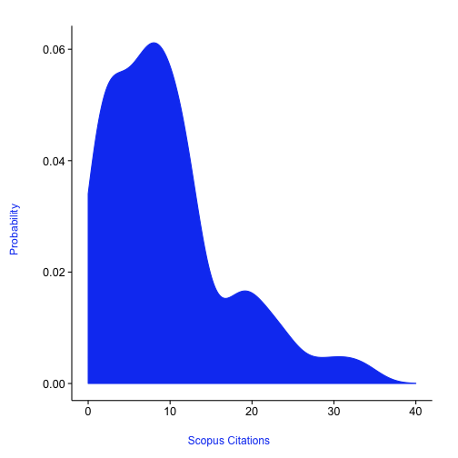
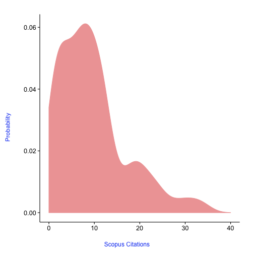
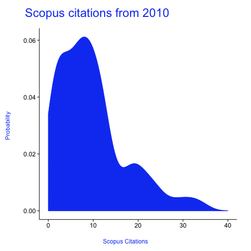
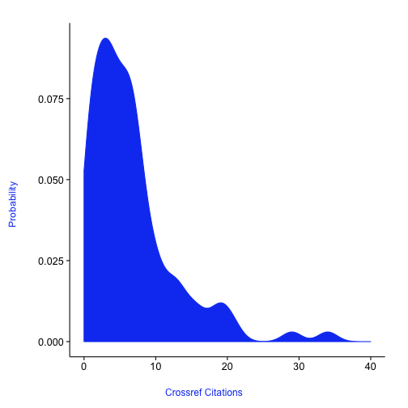
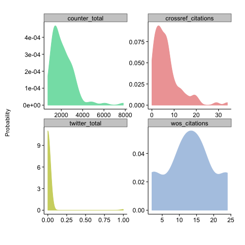

<!--
%\VignetteEngine{knitr::knitr}
%\VignetteIndexEntry{alm vignette}
-->

alm tutorial
======

## What are article level metrics? 

Glad you asked. The canonical URL for this is perhaps [altmetrics.org](http://altmetrics.org/manifesto/). Basically it is a metric that measures something about an article. This is in stark contrast to journal level metrics, like the Journal Impact Factor. 

## Are there other altmetrics data providers?

Yes indeedy. 

+ [ImpactStory](http://impactstory.it/)
+ [Altmetric.com](http://altmetric.com/)
+ [PlumAnalytics](http://www.plumanalytics.com/)

## Authentication

You aren't currently not required to use an API key to access the PLoS ALM API, but soon will need to.

Get your PLoS API key [here](http://api.plos.org/)

Put your API key in your .Rprofile file using exactly this: 
options(PlosApiKey = "YOUalmAPIKEY"), 
and the functions within this package will be able to use your API key without you having to enter it every time you run a search. 

## Install and load

You can get this package by installing via `install_github()` within Hadley Wickham's devtools package.


```r
install.packages("devtools")
require(devtools)
install_github("alm", "rOpenSci")
```


```r
library(alm)
```


## The default call with either doi, pmid, pmcid, or mdid without specifying an argument for info

(We'll not print a few columns so the table prints nicely)


```r
alm(doi = "10.1371/journal.pone.0029797")[, -c(6:8)]
```

```
NULL
```


## Details for a single DOI


```r
out <- alm(doi = "10.1371/journal.pone.0029797", info = "detail")
## totals
out[["totals"]][, -c(6:8)]
```

```
NULL
```

```r
## history
head(out[["history"]])
```

```
NULL
```


## Search using various identifiers, including pubmed id, pmc id, and mendeley id


```r
# A single PubMed ID (pmid)
alm(pmid = 22590526)[, -c(6:8)]
```

```
NULL
```

```r

# A single PubMed Central ID (pmcid)
alm(pmcid = 212692)[, -c(6:8)]
```

```
NULL
```

```r

# A single Mendeley UUID (mdid)
alm(mdid = "35791700-6d00-11df-a2b2-0026b95e3eb7")[, -c(6:8)]
```

```
NULL
```


## Search on many identifiers


```r
dois <- c("10.1371/journal.pone.0001543", "10.1371/journal.pone.0040117", "10.1371/journal.pone.0029797", 
    "10.1371/journal.pone.0039395")
out <- alm(doi = dois)
lapply(out, head)
```

```
list()
```


## Get altmetrics by year

You can also get metrics by day (`sum_metrics='day'`) or month (`sum_metrics='month'`)


```r
alm(doi = "10.1371/journal.pone.0036240", sum_metrics = "year")[, -c(6:8)]
```

```
NULL
```


## Output an-easy-to-combine-with-other-results data.frame


```r
alm(doi = "10.1371/journal.pone.0035869", total_details = TRUE)[, 3:10]
```

```
NULL
```


## Get altmetrics data for a single paper, and visualize the total data across dates


```r
out <- alm(doi = "10.1371/journal.pone.0001543", info = "detail")
almplot(out, type = "totalmetrics")
```

```
Error: 'names' attribute [1] must be the same length as the vector [0]
```


## Get detailed data for altmetrics using `almevents`


```r
out <- almevents(doi = "10.1371/journal.pone.0029797")
names(out)  # names of sources
```

```
NULL
```

```r
out <- out[!out %in% c("sorry, no events content yet", "parser not written yet")]  # remove those with no data
out[["pmc"]]  # get the results for PubMed Central
```

```
NULL
```

```r
out[["twitter"]]  # get the results for twitter (boo, there aren't any)
```

```
NULL
```

```r
out[c("twitter", "crossref")]  # get the results for two sources
```

```
NULL
```


## Retrieve and plot PLOS article-level metrics signposts.


```r
dat <- signposts(doi = "10.1371/journal.pone.0029797")
plot_signposts(input = dat)
```

```
Error: object passed to input must be a data.frame
```


Or plot many identifiers gives a line chart


```r
dois <- c("10.1371/journal.pone.0001543", "10.1371/journal.pone.0040117", "10.1371/journal.pone.0029797", 
    "10.1371/journal.pone.0039395")
dat <- signposts(doi = dois)
plot_signposts(input = dat)
```

```
Error: object passed to input must be a data.frame
```


Or make an interactive chart by doing `plot_signposts(input=dat, type="multiBarChart")`. Try it out! It should open in your browser and you can interact with it.

## Density and histogram plots from PLOS Article Level Metrics data

Note: Do you the key below in the `searchplos` call in this example, but if you plan to use rplos more, get your own API key [here](http://api.plos.org/).


```r
library(rplos)
library(plyr)
dois <- searchplos(terms = "*:*", fields = "id", toquery = list("cross_published_journal_key:PLoSONE", 
    "doc_type:full", "publication_date:[2010-01-01T00:00:00Z TO 2010-12-31T23:59:59Z]"), 
    limit = 100, key = "WQcDSXml2VSWx3P")
alm <- alm(doi = do.call(c, dois$id), total_details = TRUE)
alm <- ldply(alm)
```


The default plot


```r
plot_density(alm)
```

 


You can change the color of the density plot


```r
plot_density(alm, color = "#EFA5A5")
```

 


Pass in a title or description subtending the title


```r
plot_density(alm, title = "Scopus citations from 2010")
```

 


Plot a particular source


```r
names(alm)[1:35]
```

```
 [1] ".id"                 "doi"                 "title"              
 [4] "publication_date"    "bloglines_pdf"       "bloglines_html"     
 [7] "bloglines_shares"    "bloglines_groups"    "bloglines_comments" 
[10] "bloglines_likes"     "bloglines_citations" "bloglines_total"    
[13] "citeulike_pdf"       "citeulike_html"      "citeulike_shares"   
[16] "citeulike_groups"    "citeulike_comments"  "citeulike_likes"    
[19] "citeulike_citations" "citeulike_total"     "connotea_pdf"       
[22] "connotea_html"       "connotea_shares"     "connotea_groups"    
[25] "connotea_comments"   "connotea_likes"      "connotea_citations" 
[28] "connotea_total"      "crossref_pdf"        "crossref_html"      
[31] "crossref_shares"     "crossref_groups"     "crossref_comments"  
[34] "crossref_likes"      "crossref_citations" 
```

```r
plot_density(input = alm, source = "crossref_citations")
```

 


Plot many sources in different panels in the same plot, and pass in colors just for fun


```r
plot_density(input = alm, source = c("counter_total", "crossref_citations", 
    "twitter_total", "wos_citations"), color = c("#83DFB4", "#EFA5A5", "#CFD470", 
    "#B2C9E4"))
```

 


## Alt-metrics total citations from all sources.


```r
almtotals(doi = "10.1371/journal.pbio.0000012")
```

```
  views shares bookmarks citations
1 29519      0        79       144
```


## Get title of article by inputting the doi for the article.


```r
almtitle(doi = "10.1371/journal.pbio.0000012")
```

```
[1] "Genome-Wide RNAi of C. elegans Using the Hypersensitive rrf-3 Strain Reveals Novel Gene Functions"
```

